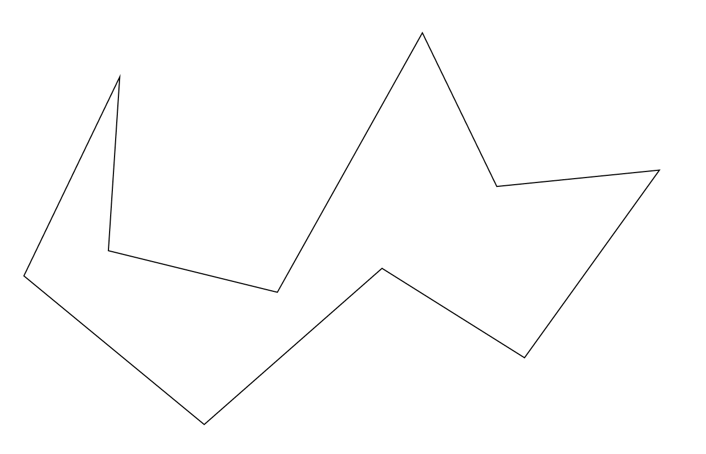
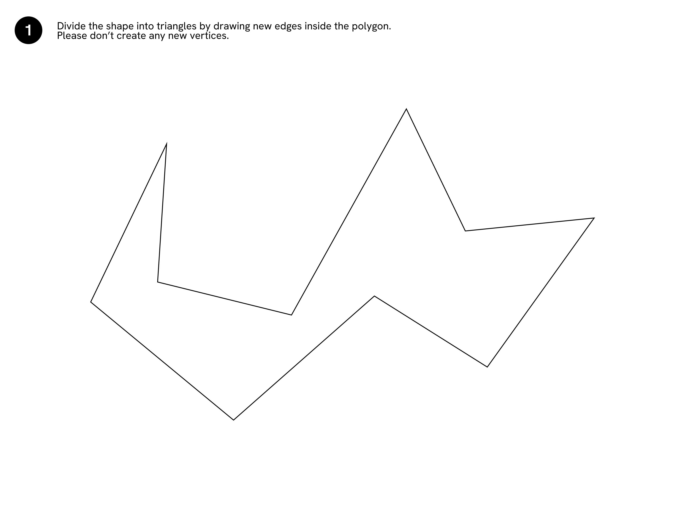
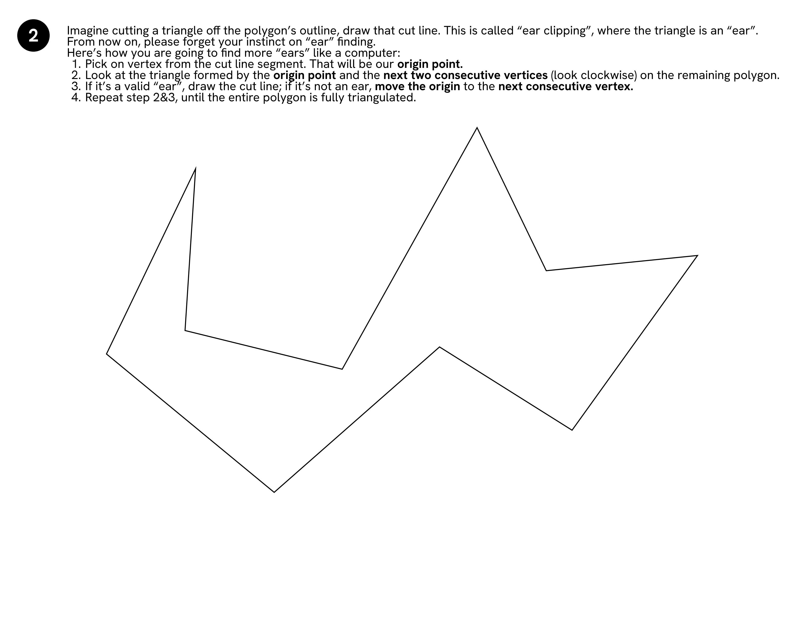
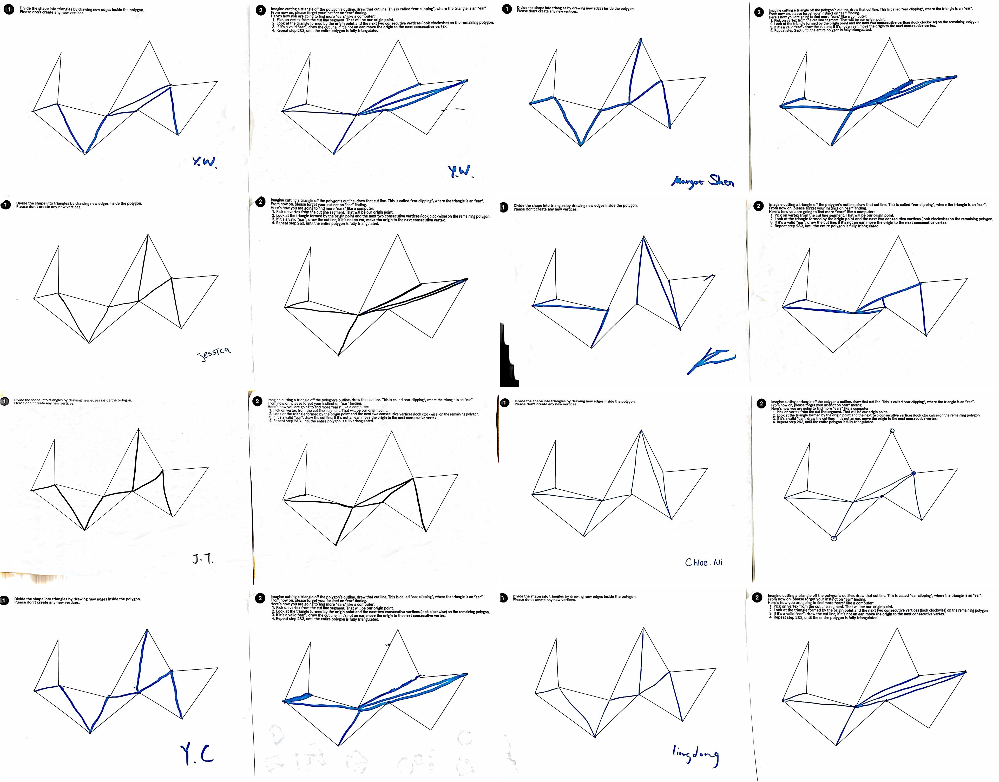

# Week 1 Homework

## Homework Prompt

Create a drawing exercise or game that teaches a computational concept. Be sure to test it with others and document your findings.

## Statement

I want to find a way to represent a computational geometry algorithm. Geometry is far more intuitive for humans than for computers.

We all have a well trained neural network to visually analyze geometry. To identify patterns and relationships between vertices and edges, we can pretty much one-shot solve the problem at a glance.

However, for computers, it's just a bunch of numbers in vertices' coordinates and abstract graph structures. Algorithms for computational geometry are oftentimes step-by-step processes to iterate over vertices and edges, and meticulous handling of all possible edge cases.

I want to force the participants to think like a computer and counterintuitively analyze a polygon as an array of vertices arranged in a certain order. For this exercise, I'm picking the simple [Ear Clipping algorithm for Polygon Triangulation](https://en.wikipedia.org/wiki/Polygon_triangulation#Ear_clipping_method).

_This exercise is dedicated to [Godfried Toussaint](https://en.wikipedia.org/wiki/Godfried_Toussaint), who taught me the beauty of computational geometry algorithms in 2018._

## Ear Clipping Algorithm

For a detailed, step-by-step explanation of the Ear Clipping algorithm, I recommend the following resource:

> **Eberly, David.**  
> _Triangulation by Ear Clipping._  
> Geometric Tools, Redmond WA, 2002–2024.  
> [Read the PDF (local copy)](assets/TriangulationByEarClipping.pdf)  
> [Read the PDF (online)](https://www.geometrictools.com/Documentation/TriangulationByEarClipping.pdf)  
> Licensed under [Creative Commons Attribution 4.0 International (CC BY 4.0)](https://creativecommons.org/licenses/by/4.0/)

This document provides clear illustrations and thorough explanations of the algorithm, including its applications to polygons with holes and nested structures. We will only focus on the simple case of a concave polygon without holes.

## The Drawing Exercise

I'm borrowing the same classic example from the PDF: a concave polygon with a bit of a zigzag shape.

### Exercise: Part 1

First, we ask the participants to triangulate the polygon with their intuition.

I wrote down the instructions as such:

> Divide the shape into triangles by drawing new edges inside the polygon. Please don't create any new vertices.

### Exercise: Part 2

Then, we ask the participants to draw the polygon with the Ear Clipping algorithm. I wrote down the instructions as such:

> Imagine cutting a triangle off the polygon’s outline, draw that cut line. This is called “ear clipping”, where the triangle is an “ear”.
>
> From now on, please forget your instinct on “ear” finding.
> Here’s how you are going to find more “ears” like a computer:
>
> 1. Pick on vertex from the cut line segment. That will be our **origin point.**
> 2. Look at the triangle formed by the **origin point** and the next two consecutive vertices (look clockwise) on the remaining polygon.
> 3. If it’s a valid “ear”, draw the cut line; if it’s not an ear, move the origin to the next consecutive vertex.
> 4. Repeat step 2&3, until the entire polygon is fully triangulated.

## Participant’s Experience

I tested the exercise with a few friends with mixed knowledge about the algorithm. People finished Part 1 very fast and the triangles were quite evenly distributed. In Part 2, people struggled to follow the exact instructions. Participants lost track of the moving origin point, which corresponds to the vertex index of focus in the iterative process. The Ear Clipping results have more [fan-shaped triangle groups](https://en.wikipedia.org/wiki/Fan_triangulation), and less even due to the fixed order of ear finding. I tried to introduce randomness to allow them to pick the first ear in the algorithm. Yet surprisingly, most of them produced the same results.

Here are some participants’ drawings from the exercise:

