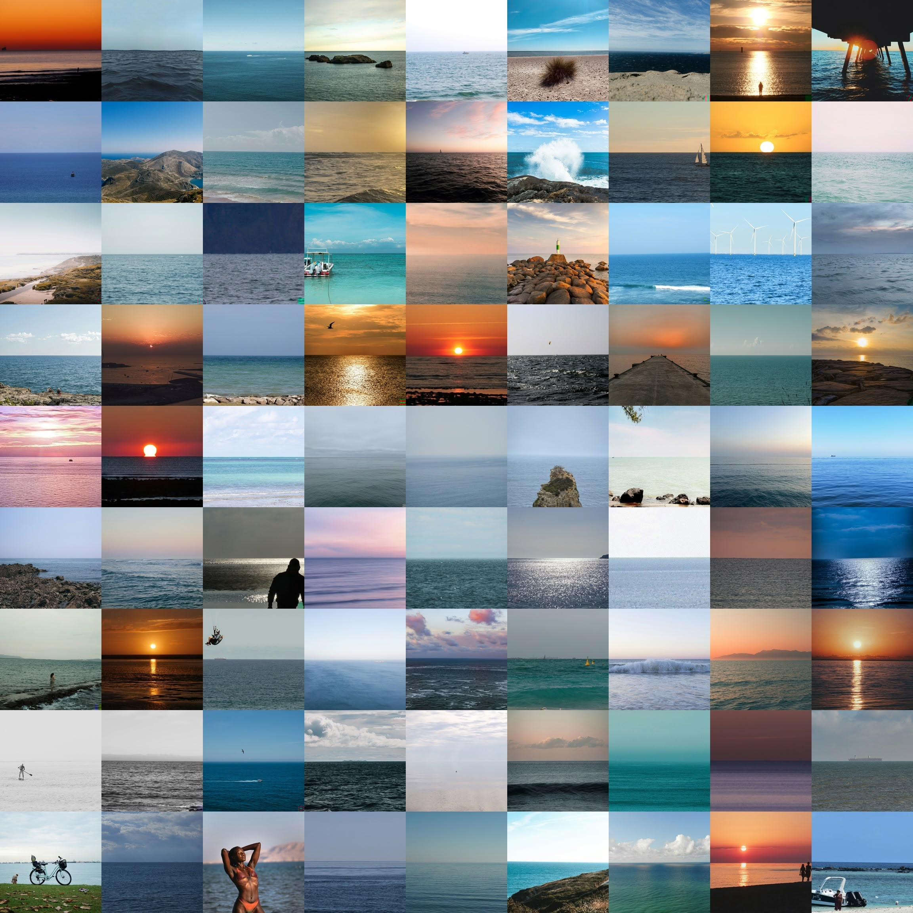
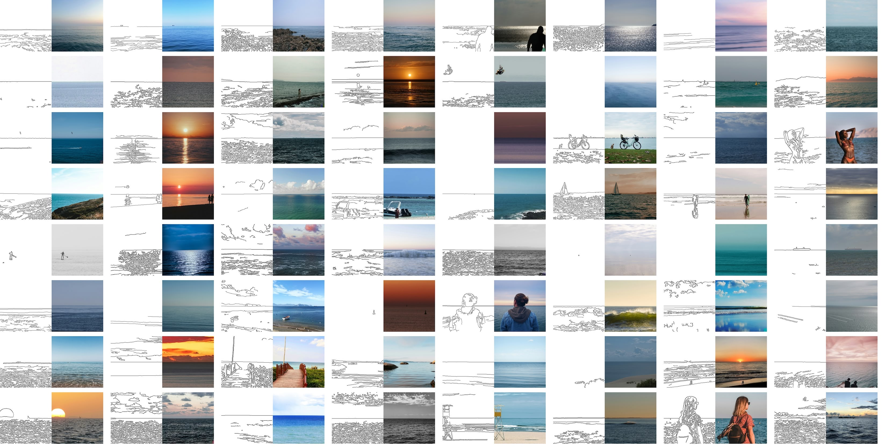
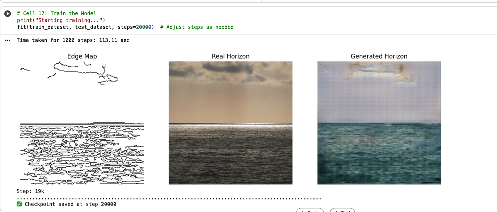
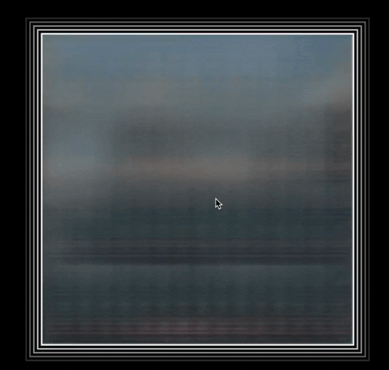

# Week 8 Homework

## Homework Prompt

Build a system that learns from drawings, extends drawings or produces drawings using a machine learning model.

## Ideas

I want to train a model from scratch with an interesting dataset. I happened to have [a dataset of seascapes aligned by its horizon line](https://www.yufengzhao.com/projects/aligned-waters). I cropped them into square images with the horizon line at the center and resized them to 256x256. The dataset is available on [Github](https://github.com/yz3440/aligned-waters/blob/main/resizer/processed_images_256.zip).

Different from the CUHK face sketch dataset using facial landmarks as input, I'm generating the input using Canny edge detection. So we are still going from a black and white sketchy strokes to a color image.

I couldn't use Lingdong's code because some Keras version issues. But fortunately, Google has an [up-to-date pix2pix documentation](https://www.tensorflow.org/tutorials/generative/pix2pix) using tensorflow in Google Colab. I adapted the code on [my own Colab notebook](https://colab.research.google.com/drive/1onltm1ZP3GThFVzqQCzZ1309z3J8opvk?usp=sharing). I trained it for 20k iterations for 40 minutes and the result looks promising at first glance.

I converted the model to a TensorFlow.js model with UINT8 quantization and uploaded it to [Github](https://github.com/yz3440/drawing-plus-plus/tree/main/week-10/homework/tfjs_horizon_model_uint8). When I'm running the model in the browser with my own drawings, I noticed the model is quite limited. It seems to overfit white space to blue gradients and black strokes to light yellow bumps (beach sands & reflections on the water).

The problem is, if you don't know what the dataset is, you don't know how to hint the model to generate the right things. To get the visitor started, I added a one-click sketch generator - it draws a horizontal line in the center, some random lines below that, and some random spirals above that. They then become the horizon, the reflections on the water, and some clouds in the sky.

I understand that it takes away the fun of drawing. To add it back, I added a timeline to record every generated result, and a play button to watch the animation. Here are some examples:

The final version is live [here](https://yz3440.github.io/drawing-plus-plus/week-10/homework/v3).

## Fun quote from reading

> Ingres famously described drawing as "the probity of art". Teach someone to draw and you have a painter, he suggested, notwithstanding that his own paintings have a dazzling, heroic, monumental presence, that they are much more than coloured drawings, more than the sum of their parts. pp.72
