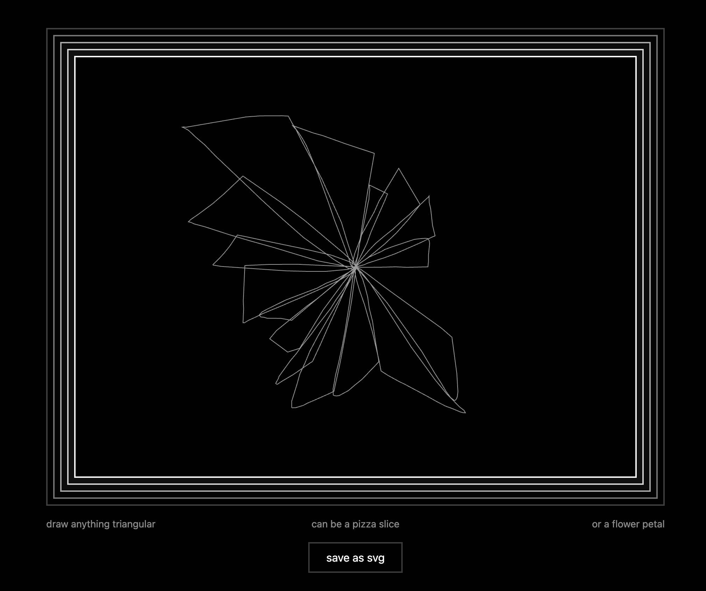
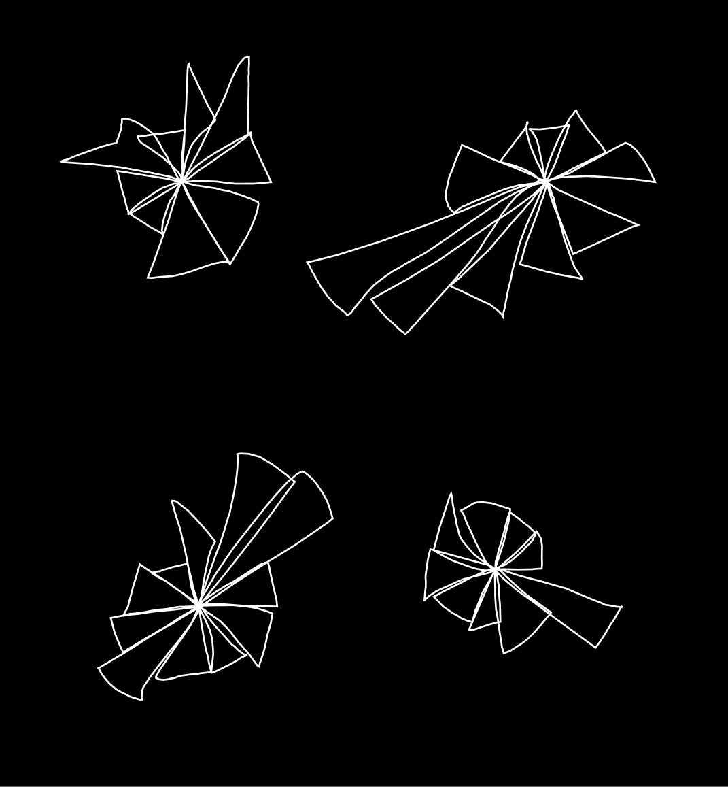
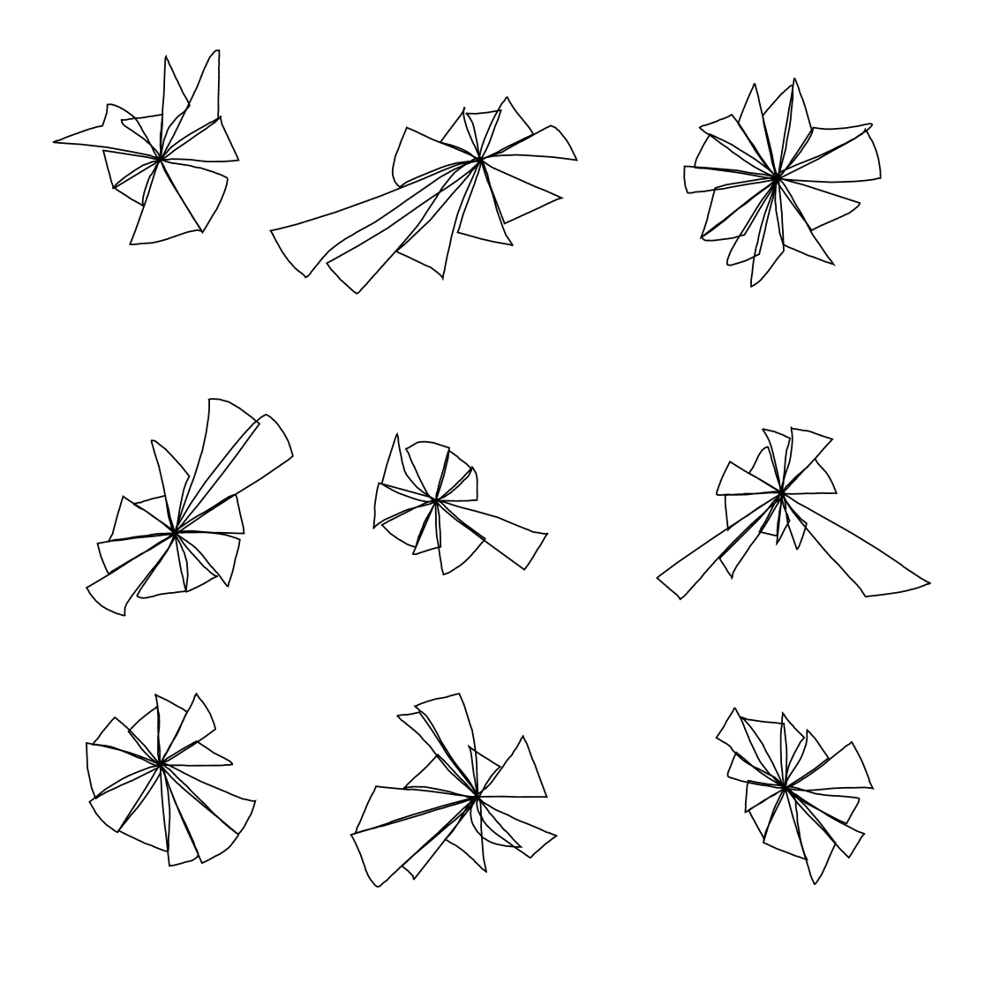
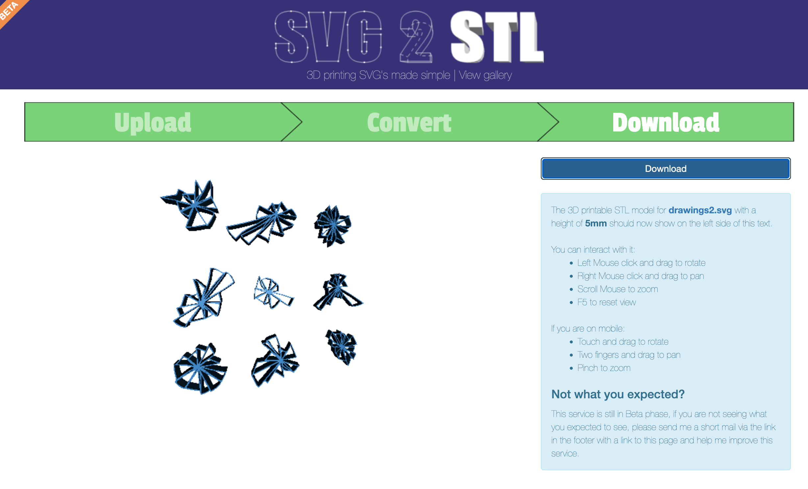
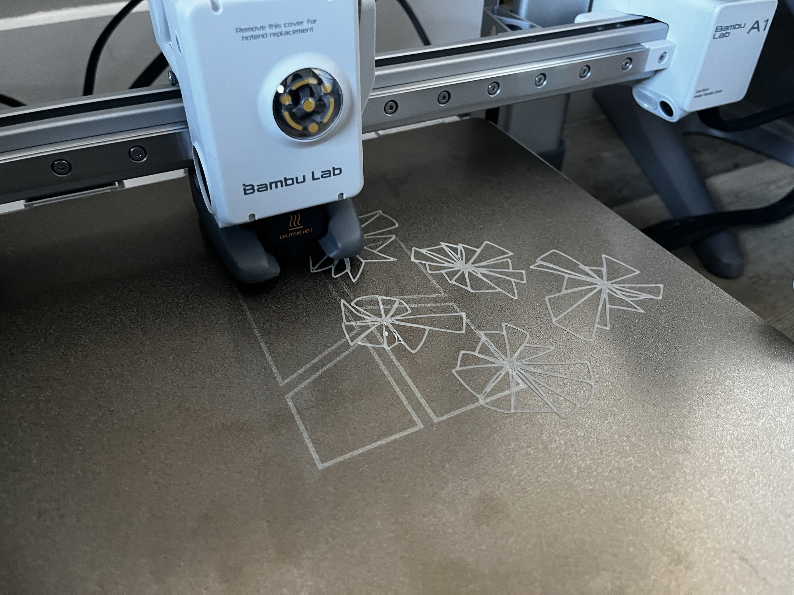
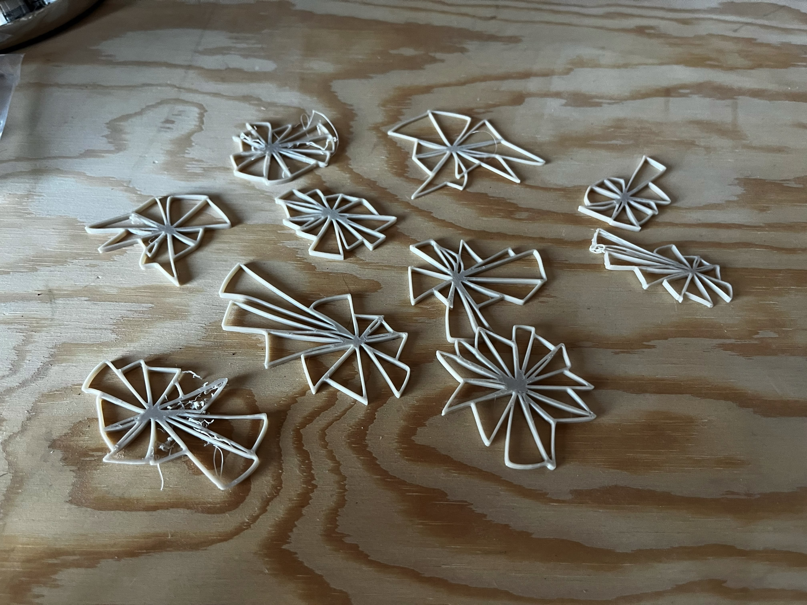

# Week 11 Homework

## Homework Prompt

Make a drawing using a robotic system (which you create or find). What are the edges or boundaries of the drawing you make?

## Ideas

I originally wanted to test out color laser engraving on metal using CBA's xTool F1 Ultra that has a fiber laser. I have a small titanium ball that I want to engrave a spherical panorama on it. Since the surface is curved, I have a lot to prepare about the files and alignment. And I only got one try. That's why I'm not doing it... Next time!

What I could do is to use a 3d printer to "draw" plastic robotically. I'm recycling my previous homework on triangle drawing and pizza packing. I added a svg export feature to the drawing app.

Here's an example of the exported drawing:

I wanted to code my own tool to convert the svg to stl 3d model, but I couldn't get it to work as well as [SVG 2 STL](https://svg2stl.com/), a free online tool I found. So I cleaned up my SVG file (inverted the color as the tool prefers), and used it to convert the svg to stl.

I have a Bambu Lab A1 so I'm using Bambu Studio to slice the stl file and print it. I compacted the layout a bit to speed up the printing (by a tiny bit).

Here's what the prints (plastic drawings) look like. The center of the pizza has a lot of overlaps which helps the shape to hold together.

The edges and boundaries are plastic with some fuzziness (print errors).
