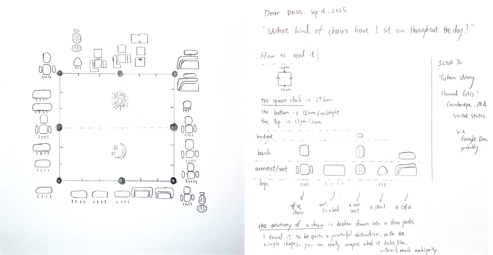
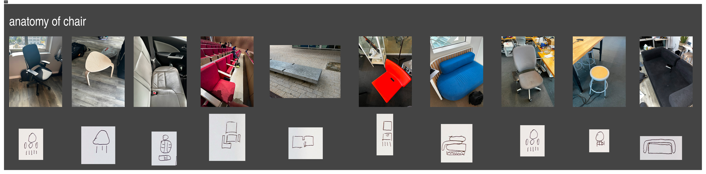

# Week 2 Homework

## Homework Prompt

Collect a data set over one day (or multiple days) and create a data postcard with a data drawing on the front and key on the back

## Statement

Partnering with Yuhan Wang

I’m bad at drawing in general. Especially ways to abstract stuff. So the avoidant side of me picked something quite concrete to visualize throughout one day with Yuhan - the chairs we have sat on for a day. During the day, I took pictures of every surface I’ve sat on, and at the end of the day I tried to abstract them into simple geometry shapes. The anatomy of chairs is composed of, from top to bottom, headrest (optional), back (optional), armrest (optional) & seat, and legs (optional).

I found this abstraction quite powerful. Once you understand the logic, it’s pretty straightforward to reconstruct the shape in 3D in my head. Turns out I’ve sat on all kinds of chairs during the day.
