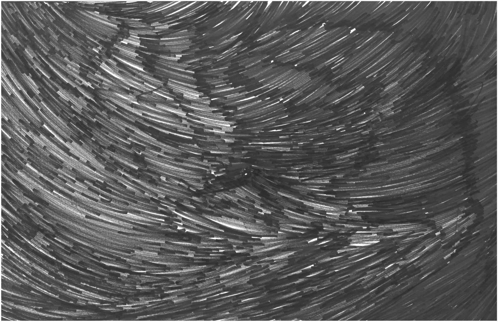
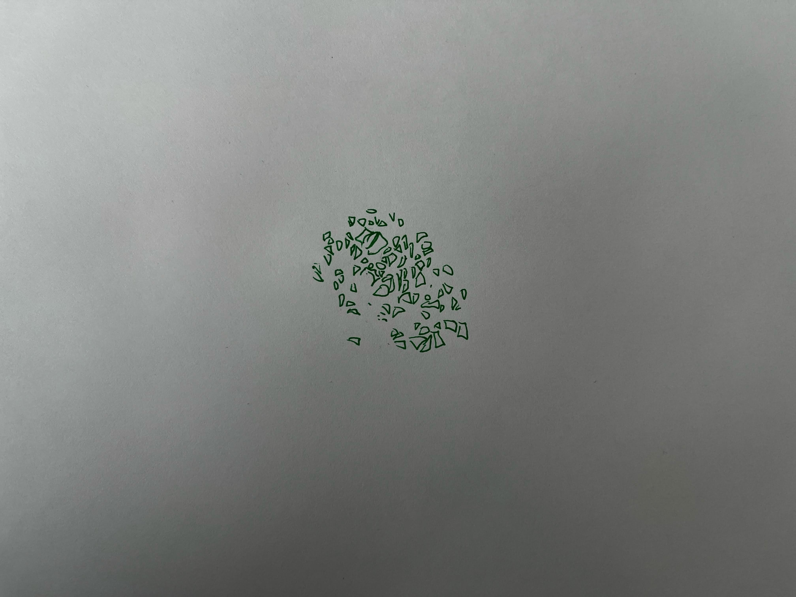
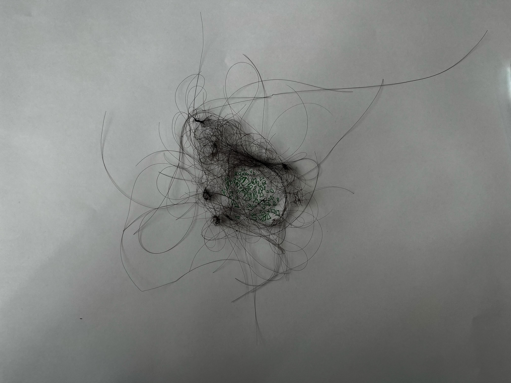
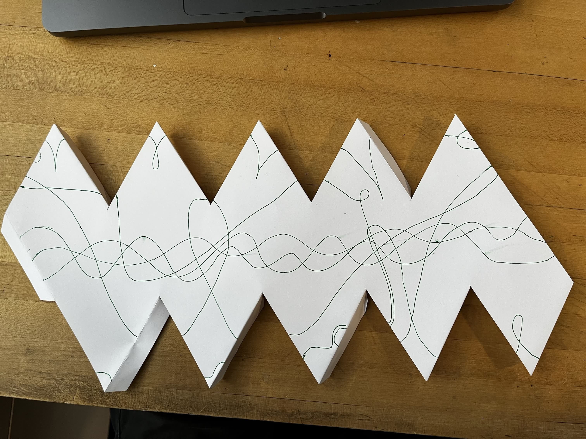
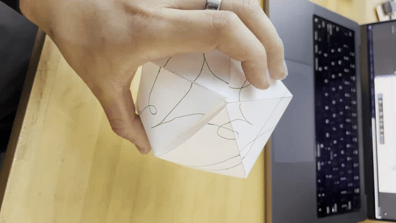
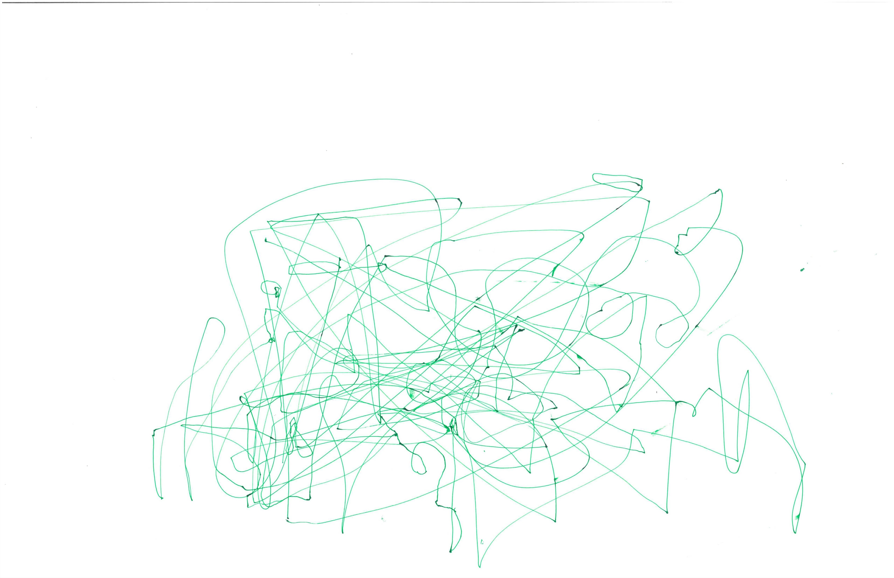
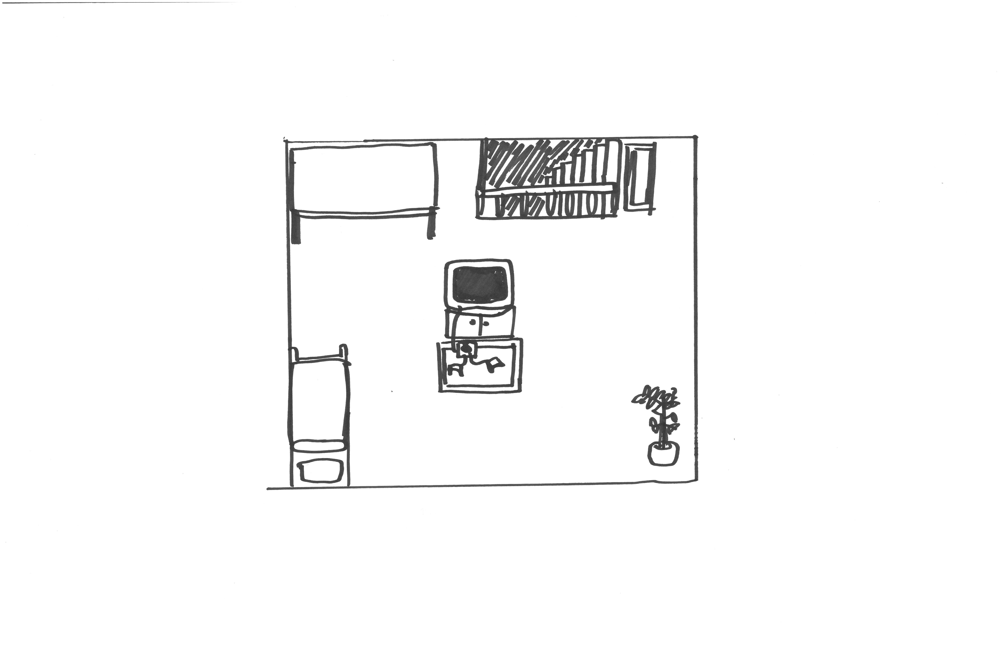
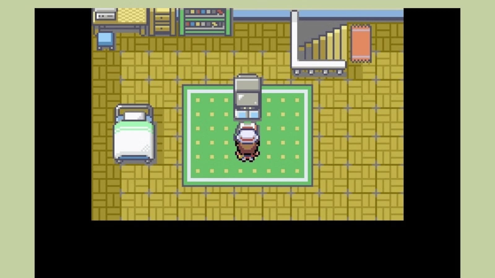
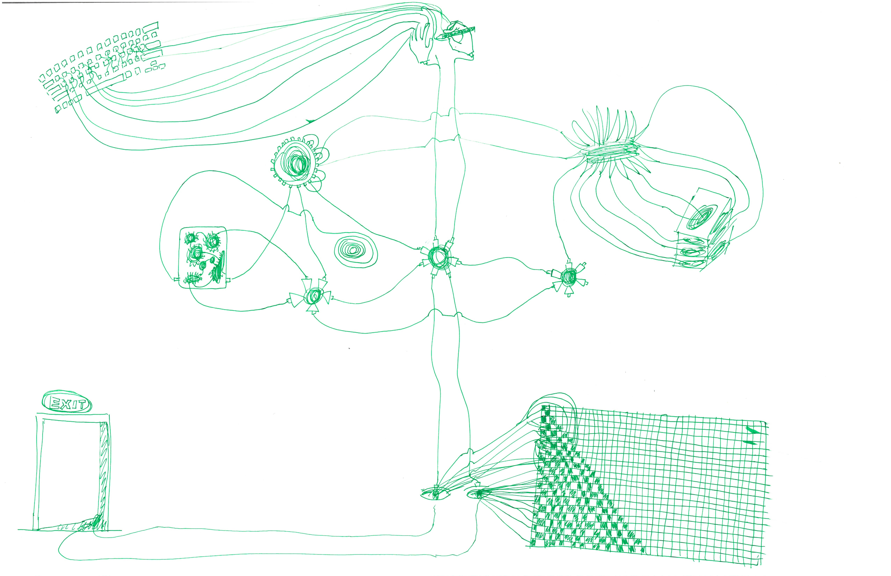
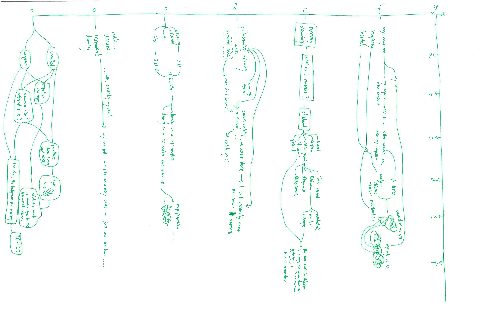

# Week 3 Homework

## Homework Prompt

7 Days of Drawing

(a) Make the smallest and largest drawing you possibly can.
(b) Create a unique instrument for making a drawing
(c) Make a drawing come to life
(d) Make a collaborative drawing with someone else
(e) Do a memory drawing
(f) Make a detailed drawing of your computer, can be realistic or imaginary
(g) Make a drawing about drawing

## Ideas

### Make the smallest and largest drawing you possibly can

Our perception of scale is relative. The moon looks larger when you see something closer next to it, and smaller when that's the only thing in the sky. It's also relative to our perceptive device, the resolution of our eyes.

The smallest thing I can identify is probably dust particles.

The largest thing I see is probably the sky, which is probably the most of the universe, much more than we have on earth.

### Create a unique instrument for making a drawing

I don't know what to do with this. I'm scratching my head and my hair falls off. I think I'll use the hair as a brush or some sort. Then I don't think if it's drawing or painting... So I decided to trace the polygons that the hair created when it's tangled together.

### Make a drawing come to life

Most lifes are 3D. Drawings are 2D. It will come to life if I turn a flat drawing into 3D. So I'm drawing on a unfolded icosahedron (reminds me of Daisuke Samejima's work, but not exactly).

### Make a collaborative drawing with someone else

On a zoom call, I use a pen to trace my friend's mouse movement (at my best ability) in real time.

### Do a memory drawing

I'm recreating the bedroom of the main character's bedroom from Pokemon Fire Red.

### Make a detailed drawing of your computer, can be realistic or imaginary

It's almost never the case when I use my computer that it doesn't involve some services that require some other computers. I'd argue that the servers on the internet, the friend's computer that's on a zoom call with me, are all my computers. I'll draw a rhizome structure of computers to illustrate the I/O connections. Also my brain is also my computer, controlling my body to connect to my computer through I/O behaviors.

### Make a drawing about drawing

This immediately reminded me the famous work of Drawing Hands by M.C. Escher. 1948. That's very literal, and my drawing hands are not as capable.

Well, I don't normally draw much. In the few cases I do, those are communication tools to convey abstract ideas to other people. This is essneitlaly technical drawing. Recently I've been drawing exclusively for this class. I think a mindmap to map my thinking process is a good way to capture my drawing process, and the mindmap itself is the drawing of my drawing process.

