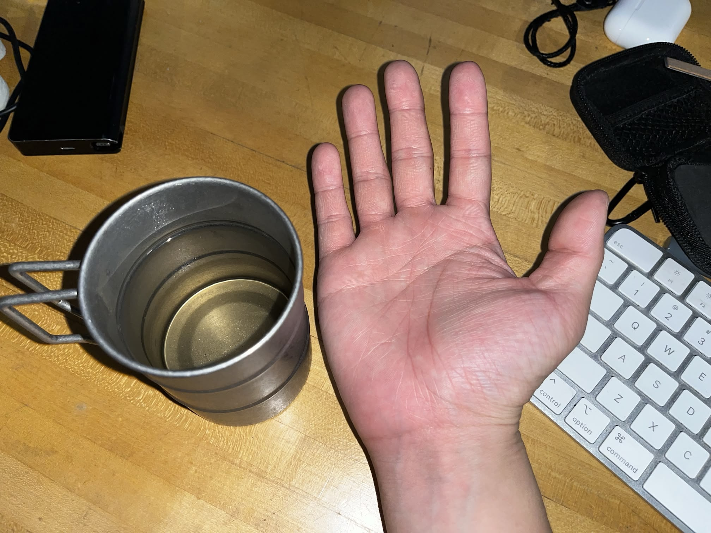
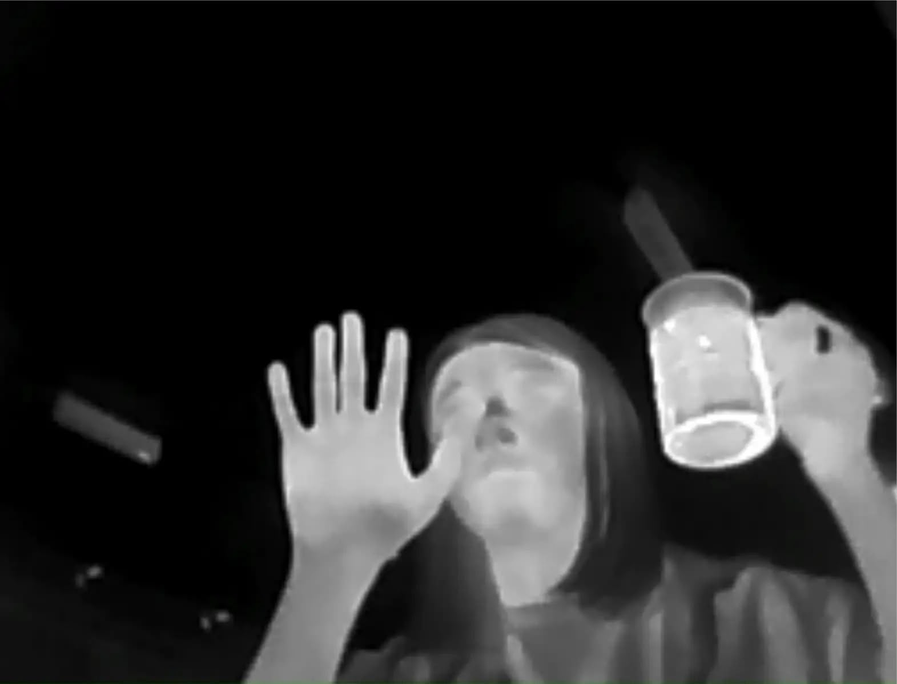

# Week 4 Homework

## Homework Prompt

Create a code-based drawing tool — can you extend gestures in an interesting way or "complicate" the act of drawing?

## Ideas

I'm quite tired of AI-based post/hand/face detection stuff, so I decided to explore alternative gesture detection methods. I happened to have an Infiray P2 Pro Thermal Camera (256x192, 25fps) so I decided to utilize temperature in some way.

This is my hand and a cup of (really hot) water, on a normal RGB camera.

This is also my hand and a cup of (really hot) water, on a thermal camera. My hand is hot but not as hot as the water.

For the coding tool, I chose p5.js for its simplicity. I'm reading from the thermal camera as if it's a USB webcam. The video feed is a grayscale image with only 8bit of depth, and temperature to brightness is always normalized to 0-255, so I cannot read the absolute temperature value, which makes things tricky. (The raw temperature data is also a video feed, but it's a `gray16le` video feed that is hard to utilize in the browser.) This means I can't extract everything in the range of human body temperature, because I don't have access to the ground truth.

So I'm utilizing the hot water creatively, because it's almost always the maximum value and easy to isolate. Of course we want it to detect "gesture", not "hot water". A fun thing with heat is that it transmits through contact, so I can isolate my hand after touching the metal cup.

I made a sketch to look for brightness from 230-255, and dimmed those darker than 230. When the cursor is hovering over the record button, it records the bright pixels. Here's a screencapture of me moving the cursor, touching the cup and trying to draw.

<video src="./assets/drawing-1.mp4" controls></video>
