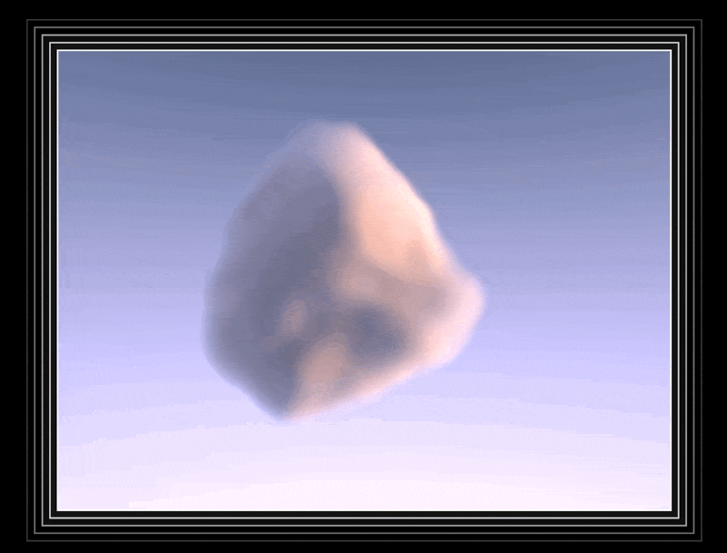
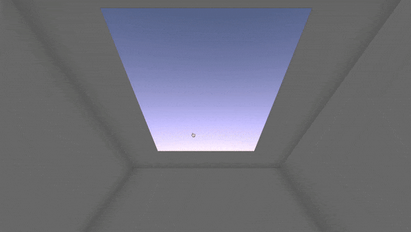

# Week 5 Homework

## Homework Prompt

Create a code based generative drawing that models something in nature, such as handwriting, grass, clouds, etc.

## Ideas

“Cloud” is literally in the homework prompt so I’m really tempted to dive into volumetric cloud rendering. Following this amazing [blog post](https://blog.maximeheckel.com/posts/real-time-cloudscapes-with-volumetric-raymarching/) by Maxime, I gained a deeper understanding of the technical landscape (even came across [EA’s solution on their game engine](https://media.contentapi.ea.com/content/dam/eacom/frostbite/files/s2016-pbs-frostbite-sky-clouds-new.pdf) and this [crazy animation by kaneta](https://www.shadertoy.com/view/WdXGRj)). Following the blog, I implemented a simple static cloud with some noise on the edge.

[prototype link](https://yz3440.github.io/drawing-plus-plus/week-5/homework/v1-webgl-cloud/)

This is somewhat nature-like but not quite generative. I then tried to use a [flocking system](https://en.wikipedia.org/wiki/Boids) to populate the cloud shapes using the boids’ position. I learned about [WebGPU](https://developer.chrome.com/docs/web-platform/webgpu). Zach reminded me that it’s still not quite “drawing”. Later I added my mouse in as one of the boids to steer the system, but it still doesn't quite feel right.  

[prototype link](https://yz3440.github.io/drawing-plus-plus/week-5/homework/v2-webgpu-flocking-cloud/)

Then I focused on mouse interaction and the cloud visual. Here I can draw clouds (by dynamically populating [SDF](https://en.wikipedia.org/wiki/Signed_distance_function) with past mouse coordinates), and the cloud would fly towards you and disappear.  

[prototype link](https://yz3440.github.io/drawing-plus-plus/week-5/homework/v3/)

I ended up liking the version where it flies away from you better.  

Initially, I switched to a square aspect ratio for performance reasons, but now it really reminds me of [James Turrell’s MoMA PS1 installation](https://www.momaps1.org/en/programs/123-james-turrell), a large square opening on the ceiling to the sky. I added some CSS perspective tricks to make the interior of the room.

I really enjoyed watching the cloud disappear.

The disappearing effect is essentially the cloud’s z position escaping the raymarching limit. In other words, it’s escaping the “speed of light” in this little raymarching sandbox.

  
[prototype link](https://yz3440.github.io/drawing-plus-plus/week-5/homework/v4/)

## Quotes from Readings

- [My Mother’s Letters, Vera Molnar](readings/1576070.pdf)
  - Actually I do not know quite what I wanted: to simulate my mother's writing or to use her handwriting as a pretext for working out new principles of composition and to remain, in spite of everything, in the specific and perhaps classical territory of the visual arts.
