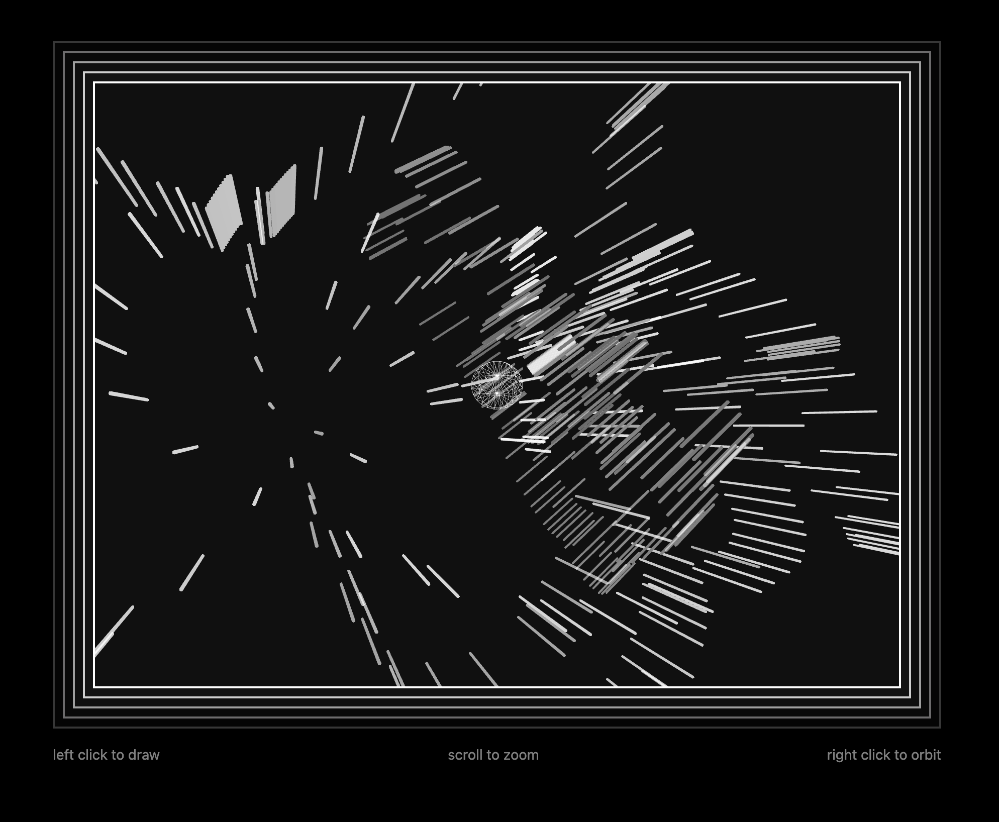

# Week 6 Homework

## Homework Prompt

Create a code based drawing system that animates, and brings drawings to life.

## Ideas

There are a few ways to extrapolate "animation" from normal drawing inputs. On a flat screen with a mouse, it's rather flat input: press, mouseX, and mouseY.

Unsurprisily inspried by [Amit Pitaru's Sonic Wire Sculptor](https://www.youtube.com/watch?v=ji4VHWTk8TQ), I'm extending the drawing space to 3D. Similarly, I cast the mouseX and mouseY to a 3D plane to get the depth info. Pitaru's canvas has a forced perspective to make the raycast Y coordinate consistent with the pitch in the sonification. I want to give my audience the freedom to move around the drawing space by adding orbit control. This way, the camera angle is also another parameter to control the drawing and animation.

I'm calling it "Line Globe". The idea is:

- Orbit control forces you to look at the origin, but allows you to look from different angles.
- Left click to draw, right click to orbit
- You draw 3D lines in a specific 3D plane that's parallel to your camera plane
- Lines are rotated around the camera viewing direction (the direction when it was drawn)
- Lines have a lifespan, and disappear when they reach the end of their lifespan (mostly a performance optimization)
- I put a sphere at the origin to help you visualize the drawing space

Here's the [live link](https://yz3440.github.io/drawing-plus-plus/week-6/homework/v2).

<video src="assets/line-globe.mp4" autoplay muted loop></video>

## Fun quote from reading

> My professor asked me a question that I still think about when I see an art and tech project: “Is this an art project or a tech demo?”
