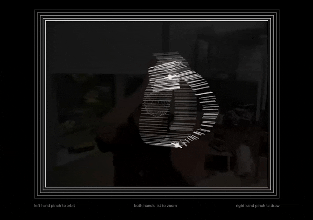

# Week 8 Homework

## Homework Prompt

Use an image or video as input to make a drawing (using computer vision) or Create a code based drawing tool that augments or extends the movements of the human body.

## Ideas

I really loved my last homework, so I'm going to extend it with some ml5 CV stuff. I picked the hand pose detection model that gives you the keypoints of the hand at each joint. The original control I had was Orbit X&Y, Zoom, and Draw X&Y from mouse inputs. Now I'm replacing the mouse inputs with hand gestures, which allows for more natural, intuitive, and concurrent control.

After some experimentation, I made the following mapping:

- Left hand pinch and move to orbit
- Right hand pinch and move to draw
- Both hands fist and move closer or farther to zoom

Here's the [live link](https://yz3440.github.io/drawing-plus-plus/week-8/homework/v1).

The ml5 model gets a bit jittery when there are too many things going on in the frame. This greatly affects the drawing experience as continuity is crucial to gestural control. If I'm moving forward with this idea, I need to switch to a different web model, or go native.

<video src="assets/line-globe-with-gestures-optimised.mp4" autoplay muted loop></video>

## Fun quote from reading
