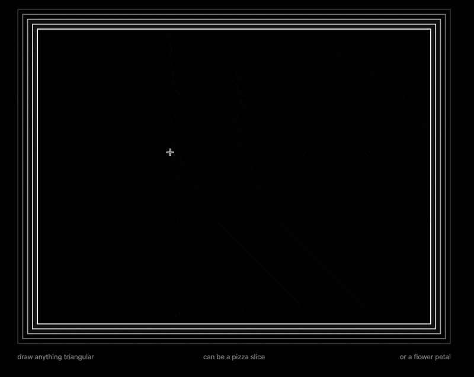
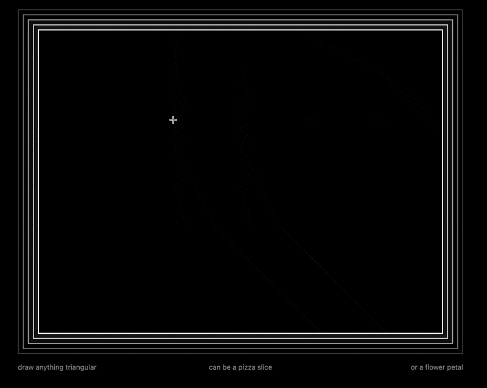
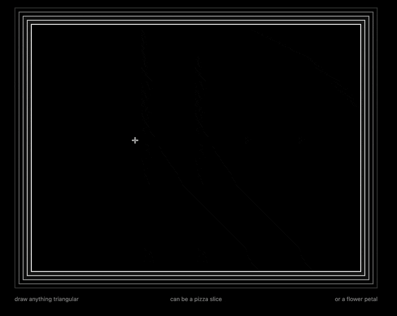

# Week 8 Homework

## Homework Prompt

Create a tool that detects and responds to specific drawings.

## Ideas

I want to build a tool to detect triangle-esque shapes and put them in a pizza. Here's the flow:

- user draws an arbitrary polyline
- extract the **first polygon** from the polyline
- compute the **convex hull** of the **first polygon**
- simplify the **convex hull** down to 3 points, a **triangle** (using Douglas-Peucker algorithm with progressive tolerance)
- compare the area of the **convex hull** and the area of the **triangle**
  - if the ratio is greater than a threshold, the shape is a triangle
  - if the ratio is less than a threshold, the shape is not a triangle
- if not triangle, discard
- if triangle,
  - find the sharpest tip of the triangle, and translate to the center of the pizza
  - rotate the triangle to fit into the pizza

Here's the [live link](https://yz3440.github.io/drawing-plus-plus/week-9/homework/v1).

Here's a demo of the detection process:

Here's me trying to form an actual pizza:

Here's me messing around:

